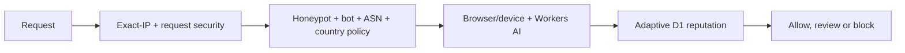

# 🛡️ Bot Block V7

### Adaptive AI edge defense for Cloudflare Workers

[](https://github.com/boxerjr/Bot_Block_v7-adaptive-learning/actions/workflows/m22-public-monitor-tests.yml)
[](https://github.com/boxerjr/Bot_Block_v7-adaptive-learning/actions/workflows/v7-production-smoke.yml)
[](https://workers.cloudflare.com/)
[](LICENSE)

**Bot Block V7** is a layered anti-bot and traffic-policy engine for Cloudflare Workers. It combines deterministic edge controls, browser/device consistency checks, Workers AI, adaptive D1 reputation, operator feedback, Telegram controls, ASN/organization intelligence, honeypots and privacy-preserving exact-IP state.

It is built for a clear operating model: allow traffic that is consistent with a real person on an allowed connection, and stop obvious hosting, VPN, proxy, scanner, automation, spoofing and policy-violating traffic as early as possible.

> V7 does not promise perfect bot detection. It gives you independent, inspectable layers that make cheap decisions first, keep AI in an evidence role, and learn from explicit operator feedback.

## Why people test V7

- **Fast at the edge:** deterministic checks run before browser inspection or AI.
- **No runtime dependency on another blocker:** local request security and bot intelligence are shipped in the Worker.
- **Production-shaped:** redirect enforcement, cron maintenance, health reporting, D1 migrations and smoke checks are included.
- **Privacy-first learning:** raw IPs and raw User-Agents are not persisted; shared intelligence is ASN-level only.
- **Operator control:** Telegram can block/unblock an exact IP and controlled owner sessions can confirm `IT'S ME` or `NOT ME`.
- **Easy to fork:** one repository, one example Wrangler config, explicit secrets and a reproducible test suite.

## At a glance

| Component | Included implementation |
| --- | --- |
| Runtime | Cloudflare Worker (JavaScript) |
| AI | Workers AI with sanitized evidence |
| State | Cloudflare D1; R2 for controlled dataset captures |
| Intelligence | Local signatures, ASN/org policy, Spamhaus refresh, optional V7 community feed |
| Operator controls | Telegram callbacks (optional) |
| Verification | 172 regression tests + migration verification + production smoke workflow |
| License | MIT |

## Decision pipeline



The rule is simple: **spend expensive browser/AI work only on traffic that survives deterministic policy.**

## Install and test on a new Cloudflare account

The complete, copy/paste installation guide is [`docs/INSTALL.md`](docs/INSTALL.md). The shortest safe path is:

```bash
git clone https://github.com/boxerjr/Bot_Block_v7-adaptive-learning.git
cd Bot_Block_v7-adaptive-learning
npm install
cp wrangler.example.jsonc wrangler.jsonc
npx wrangler login
```

Create fresh resources for this installation:

```bash
npx wrangler d1 create v7-adaptive-learning
npx wrangler r2 bucket create v7-adaptive-dataset
```

Copy the D1 `database_id` printed by Wrangler into `wrangler.jsonc` in place of `REPLACE_WITH_YOUR_D1_DATABASE_ID`. The Worker name in `wrangler.jsonc` is only a deployment label: keep `v7-adaptive-learning` or change it to any unique name you prefer.

Set the four required secrets. Redirect destinations must be HTTPS:

```bash
npx wrangler secret put CHALLENGE_SECRET
npx wrangler secret put ADMIN_SECRET
npx wrangler secret put ORIGIN_URL
npx wrangler secret put BLOCK_URL
```

Optional Telegram controls:

```bash
npx wrangler secret put TELEGRAM_TOKEN
npx wrangler secret put TELEGRAM_CHAT_ID
```

Run the release verification and deploy:

```bash
npm run verify
npm run deploy
```

After deployment, check `https://YOUR-WORKER-DOMAIN/_health`. Never reuse another installation's D1 ID, R2 bucket, redirect destinations or secrets.

## Safe defaults to review

The example config is intentionally strict for a Spain-only mobile deployment. Change these values before protecting a different audience:

| Variable | Default | Meaning |
| --- | --- | --- |
| `ALLOWED_COUNTRIES` | `ES` | Comma-separated country allow-list |
| `MOBILE_ONLY` | `true` | Reject desktop claims before deep inspection |
| `HUMANS_ONLY` | `true` | Reject precise bot/crawler declarations |
| `LOCAL_STATIC_BOT_INTEL_ENABLED` | `true` | Enable the bundled 194-signature layer |
| `LOCAL_REQUEST_SECURITY_ENABLED` | `true` | Enable independent request-target protections |
| `HONEYPOT_ENFORCING` | `true` | Enforce the global honeypot gate |
| `RATE_LIMIT_PER_MIN` | `3` | Fourth request in a rolling minute blocks that exact IP |
| `REDIRECT_ENFORCING` | `true` | Send allowed traffic to `ORIGIN_URL`, blocked traffic to `BLOCK_URL` |
| `OWNER_LEARNING_MODE` | `false` | Keep off except during a controlled owner-only session |

See [`wrangler.example.jsonc`](wrangler.example.jsonc) for every runtime variable. Keep `OWNER_LEARNING_MODE=false` for public traffic.

## What is inside the defense

### Deterministic infrastructure policy

Cloudflare `asOrganization` metadata is classified into `consumer_isp`, `mobile_carrier`, `hosting_cloud`, `vpn_proxy` and `unknown`. Known hosting/VPN/cloud networks are blocked early and can be promoted to a local `HARD` ASN decision. Consumer and mobile providers continue to the next layer; they are never treated as proof of a human by themselves.

V7 combines V6.3 static `HARD_ASNS`, `RISK_ASNS` and `SAFE_ASNS`, deterministic organization promotion, a daily Spamhaus ASN-DROP refresh and optional V7 Community Intelligence.

### Local request security and honeypots

Before browser or AI processing, V7 detects high-confidence request targets such as encoded or double-encoded traversal, null-byte/CRLF injection, dangerous PHP/file wrappers, PHP runtime overrides, response-splitting probes, command-download probes and secret-file queries.

The global honeypot gate preserves the 40-path V6.3 baseline and adds scanner targets such as:

```text
/.env              /.git/config       /.ssh/id_rsa
/wp-admin          /phpmyadmin        /secrets
/backup.zip        /actuator/env      /solr/admin
```

A match is handled locally: AI is skipped, the exact IP HMAC is blocked, and the request goes to `BLOCK_URL` (or a blank 404 fallback). Normal support paths such as `/favicon.ico` and `/robots.txt` are not honeypots.

These protections are independently implemented from public WAF security categories. No external blocker project is downloaded, called or executed at runtime.

### Bundled local bot intelligence

The Worker ships a curated set of **194 precise** scanner, automation and self-declared crawler signatures. With `HUMANS_ONLY=true`, identifiers such as `GPTBot`, `ClaudeBot`, `Googlebot`, `Bytespider`, `SemrushBot`, `sqlmap`, `masscan`, `Acunetix` and headless automation are rejected before ASN, country, browser and AI processing.

Ambiguous short words and upstream raw-IP/referrer lists are intentionally excluded. A local signature match is an enforcement signal, not a learning label and not an ASN reputation update.

### Browser, device and Workers AI evidence

Traffic that survives deterministic policy enters silent browser inspection. V7 checks device/browser coherence, spoof signals, fingerprint history and related evidence instead of trusting the User-Agent alone. Workers AI receives sanitized evidence plus network/organization context and returns classification guidance.

**AI is evidence, never truth by itself.**

### Adaptive D1 reputation

Explicit feedback can update ASN and fingerprint reputation with labels such as `human_confirmed`, `bot_confirmed`, `spoof_confirmed`, `false_positive`, `false_negative` and `uncertain`. Evidence decays over time, with fingerprint evidence decaying faster than ASN evidence.

This is immediate reputation learning; it does not retrain the Llama model after every click.

### Telegram and controlled owner learning

Telegram supports signed, event-bound callbacks for `BLOCK IP` and `UNBLOCK IP`. In an explicitly controlled owner-only session, `HUMAN_PASS` can expose `✅ IT'S ME` and `❌ NOT ME`:

- `IT'S ME` records `human_confirmed` with confidence 100.
- `NOT ME` records `false_negative` with confidence 100 and blocks the exact IP.
- No confirmation inside three minutes becomes automatic `NOT ME`.
- Callback/timer races are checked against the original event timestamp.

The mode is fail-closed and defaults to off. Do not enable it for uncontrolled public traffic.

### Privacy-preserving Community Intelligence

Separate V7 deployments can share an ASN-only feed through [`community-feed`](https://github.com/boxerjr/Bot_Block_v7-adaptive-learning/tree/community-feed). The export never contains raw IPs, raw User-Agents, fingerprints, browser telemetry, event IDs, Telegram data or secrets. Shared `HARD` entries are limited to V7-derived hosting/VPN/proxy infrastructure; strong feedback consensus can create `RISK`, never global `HARD` by itself.

The Worker export is available at `/_community/intelligence.json`. The optional publisher workflow validates the privacy/schema invariants and writes only the `community-feed` branch.

## Verify it yourself

Run the local suite:

```bash
npm test                 # 172 passing tests
npm run test:migrations  # local D1 migration check
npm run verify           # both release checks
```

For a disposable test IP, these smoke checks demonstrate the main boundaries:

1. Visit `/` with a normal browser: it enters the browser inspection flow.
2. Visit `/.env`: it is treated as a hostile honeypot, skips AI and blocks the exact IP.
3. Request `/?file=%252e%252e%252fetc%252fpasswd`: encoded traversal is classified locally.
4. Send a precise scanner User-Agent such as `sqlmap`: it is rejected by local intelligence.
5. Request `/favicon.ico` or `/robots.txt`: neither is a honeypot.
6. Open `/_health`: verify redirect, honeypot, local security, local intelligence, ASN and Community Intelligence readiness.

Use only a disposable test IP for hostile-path checks so you can unblock it from Telegram or D1 tooling afterwards.

## Documentation map

- [`docs/INSTALL.md`](docs/INSTALL.md) — clean-account setup, secrets, migrations and deployment
- [`docs/FEATURES.md`](docs/FEATURES.md) — complete decision order and feature reference
- [`docs/COMMUNITY_INTELLIGENCE.md`](docs/COMMUNITY_INTELLIGENCE.md) — feed schema, privacy rules and publisher
- [`docs/ARCHITECTURE.md`](docs/ARCHITECTURE.md) — runtime boundaries and data flow
- [`SECURITY.md`](SECURITY.md) — security reporting and sensitive-data rules

## Repository layout

```text
src/compat/v63/      V6.3 compatibility policy
src/adaptive/        reputation, intelligence, feedback, Telegram, redirects
src/storage/         D1/R2 persistence helpers
migrations/          D1 schema
legacy/              archived V6.3 reference
docs/                install, architecture, validation and feature guides
test/                regression tests
community-feed       sanitized shared intelligence branch
```

## Project philosophy

**AI is evidence, not truth.**

**Operator feedback is explicit truth.**

**Deterministic infrastructure policy is the cheapest first line.**

**Shared intelligence is aggregate ASN data, never visitor-level data.**

If you test V7, please open an issue with reproducible behavior (without tokens, redirect secrets, raw IP lists or private telemetry). Contributions that improve detection without weakening privacy or fail-closed controls are welcome.
